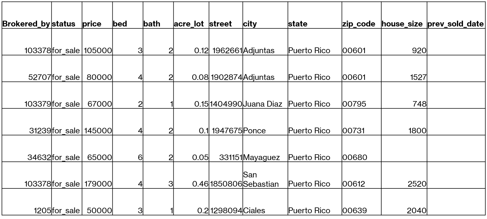
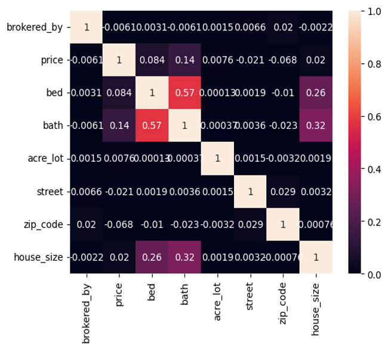
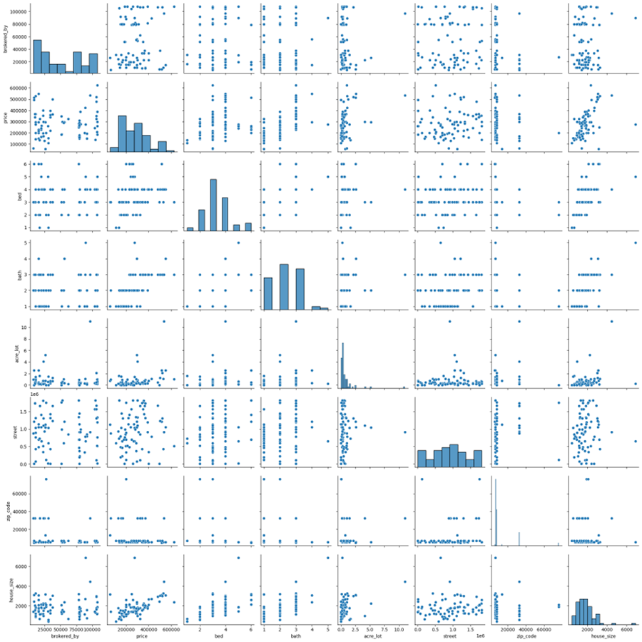
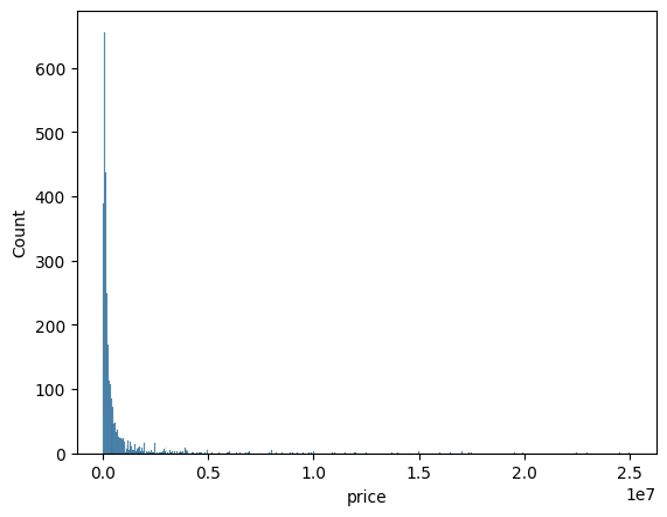
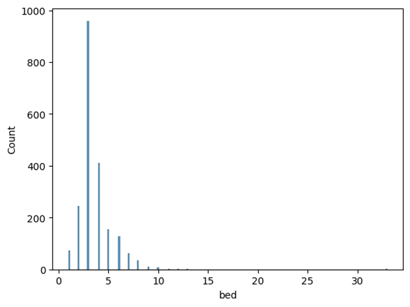
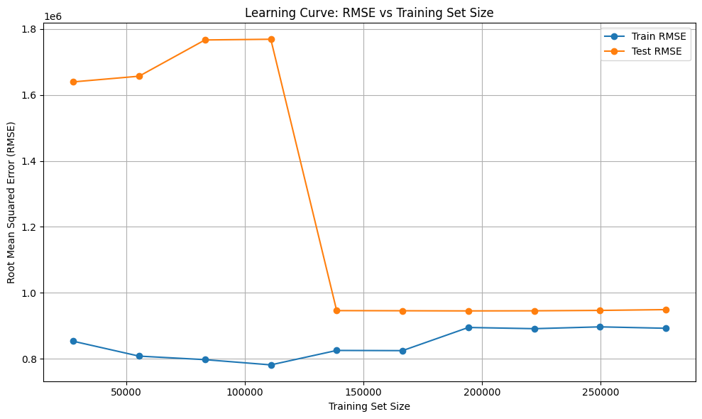
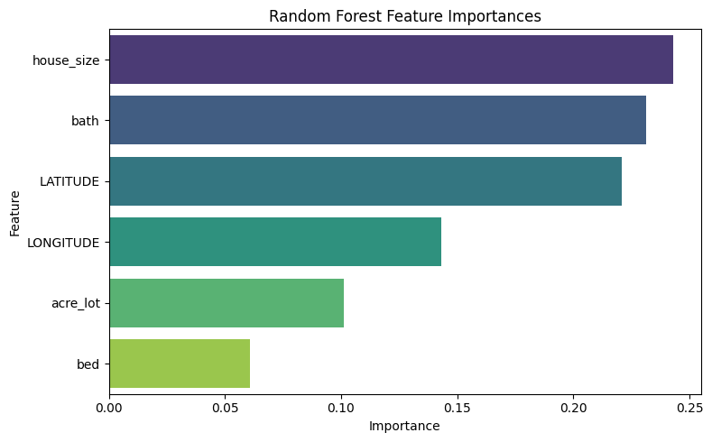

# 2025_ia651_mutiro_chinyadza
Code for 2025 IA 651 Final Project. Teammates Tafadzwa Mutiro and Ruvarashe Chinyadza

## USING REGRESSION TECHNIQUES TO IDENTIFY UNDERVALUED PROPERTIES THAT CAN BE BOUGHT AND SOLD FOR A PROFIT

## DATASET FROM KAGGLE

## CORRELATION MATRIX

The correlation matrix shows the relationships between house features and prices. 
The matrix shows that price has a strong positive correlation with bath (0.14) suggesting that houses with more bathrooms tend to have higher prices. 
There is also a moderate positive correlation between bed and bath (0.57), indicating that houses with more bedrooms tend to have more bathrooms
However, there was a low correlation between house size and price of 0.02 although it was still somewhat positive. This could be offset by houses in the rural having larger sizes but cheaper than those in the cities.

## SCATTERPLOT MATRIX 

The correlation has changed from the one we had on the correlation matrix
The correlation has increased on factors such as price, bed, bath and street indicating there is now a strong correlation between house features and prices

## PRICE HISTOGRAM

Most properties are relatively affordable, with a few high-end outliers pulling the price range far to the right. The graph is positively skewed.

## BEDROOM NUMBER HISTOGRAM

This histogram shows the distribution of the number of bedrooms in a house
The distribution shows that most homes have 3 bedrooms indicating that these are single family houses
Properties with more than 10 bedrooms are very rare unless they are commercial properties

## Data preprocessing Steps

Dropped all rows with null values in the dataset
Dropped duplicates based on all variables
Geocoded the data by city and state

## Testing for underffiting or overfitting
The RMSE plot below suggested that there was a bit of overfitting so we decided to fit lasso, ridge and elastic regression. 

## BEST MODEL PERFORMANCE USING GRID SEARCH
The four models were fitted and optimised using grid search. The best hyper parameters for each model are given in the table below. The random forest seems to be the be the best model explaining for 61% of variance compared to the 18 percent of the other models.
| Model        | Best Hyperparameters                                      | Mean Squared Error (MSE) | R²     |
|--------------|-----------------------------------------------------------|--------------------------|--------|
| **Ridge**    | `{'regressor__alpha': 100}`                               | 1.15 × 10¹²              | 0.1837 |
| **Lasso**    | `{'regressor__alpha': 100}`                               | 1.15 × 10¹²              | 0.1837 |
| **ElasticNet** | `{'regressor__alpha': 10, 'regressor__l1_ratio': 0.7}` | 1.29 × 10¹²              | 0.0843 |
| **RandomForest** | `{'max_depth': None, 'max_features': 'sqrt', 'min_samples_leaf': 1, 'min_samples_split': 5, 'n_estimators': 200}` | 5.49 × 10¹¹ | 0.6109 |

[Clarkson Github Organisation](https://github.com/clarkson-Applied-Data-Science)

## FEATURE IMPORTANCE
The graph below shows the feature importance from the best random forest model. House size , lattitude and number of baths seems to be the most importance feauters that explain house price.Longitude also explain a relatively significant proportion as well.

## SUMMARY
  In this project, several regression models were trained and evaluated to predict house prices using features such as number of bedrooms, bathrooms, lot size, house size, and geographic coordinates. After splitting the data into training and test sets, features were scaled using StandardScaler to prevent data leakage. Hyperparameter tuning was performed using GridSearchCV for Ridge, Lasso, ElasticNet, and Random Forest regressors. Ridge and Lasso both performed best with an alpha of 100, while ElasticNet achieved optimal performance with an alpha of 10 and l1_ratio of 0.7. The Random Forest model outperformed all linear models, achieving the lowest mean squared error (5.49 × 10¹¹) and highest R² score (0.6109), with its best parameters including 200 trees, a max_features setting of 'sqrt', and a min_samples_split of 5. Feature importance analysis revealed that house size, number of bathrooms, and geographic location were the most influential predictors. While linear models struggled with underfitting due to their simplicity, the Random Forest captured complex patterns in the data more effectively.  

